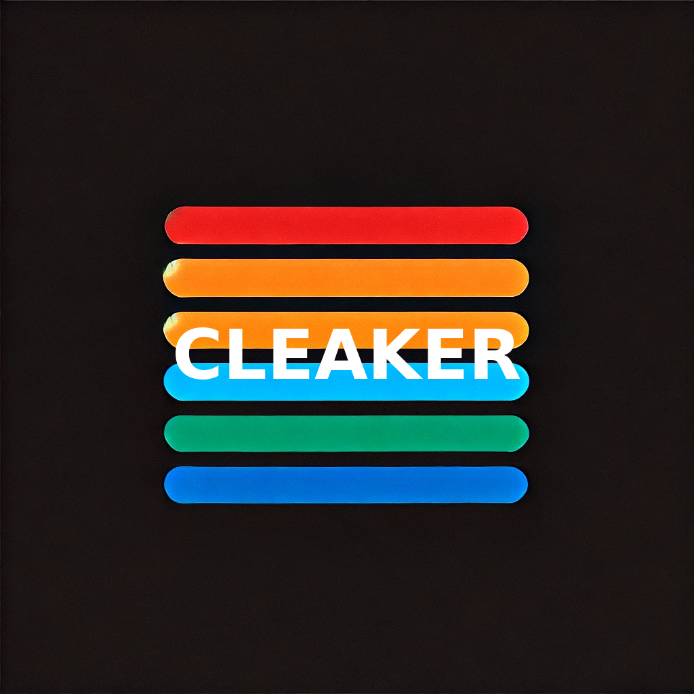

## Cleaker Ecosystem

This repository contains the core components of the Cleaker ecosystem, including client interfaces, API endpoints, and Node.js modules. Together, these components enable the functionalities and services offered by Cleaker.

Repository Structure

1. API Server

The backend API server powers Cleaker’s core functionalities and is located at: /api/

This server handles:
	•	Authentication and user management.
	•	API endpoints for interacting with Cleaker services.
	•	Core business logic and integrations.

1. Client Interface

The React Vite app serves as the front-end interface for Cleaker and is located in:

/web.client/

The app is built using React and Vite, providing a fast and modern user experience.

Build Outputs

The Vite build for deployment is located at:

/web.client/dist

Learn More About Cleaker, visit:
- [Cleaker](https://cleaker.me)
- [Neurons](https://neurons.me)
